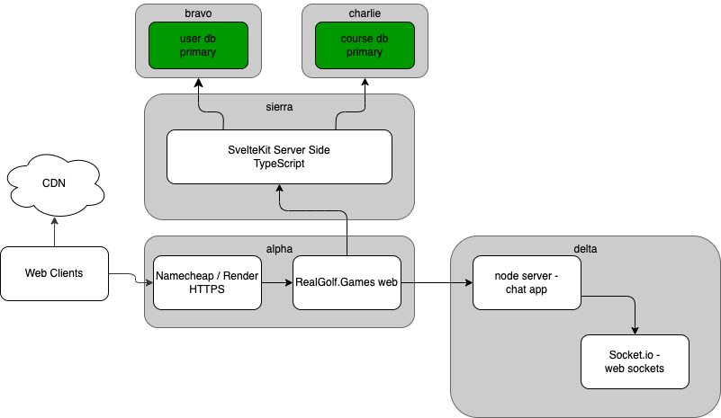

# RealGolf.Games Web

  

## Introduction

Welcome to the RealGolf.Games website repository! This project serves as the hub for RealGolf's training platform. Whether you're a developer, contributor, or user, this README provides essential information to get you started.

You can visit the live website at [realgolf.games](https://realgolf.games).

## Project Overview

RealGolf.Games Web is a web-based platform that enhances your golf training experience. This repository contains all the data and code for the website.

## Production Architecture

## Badges

- **Render Status**:  - Indicates the current deployment status of the website on Render.
- **CodeQL**:  - Code quality analysis using GitHub CodeQL.
- **GitHub Repo Size**:  - Shows the size of the GitHub repository.

## Usage and Features

RealGolf.Games Web offers the following features:

- 3 different Golf Games, which include
  - 4Winning
  - Exact
  - Precision
- User Authentication with MongoDB
- Golf Course Score Tracker **Currently under development**
- Local multiplayer functionality for users to play against each other on the same device.
- Feature issue [#160](https://github.com/realgolf/web/issues/160) raised for implementing remote multiplayer, enabling users to compete against each other online.

## License

This project is licensed under the [All Rights Reserved License](LICENSE.md).

## Acknowledgments

We would like to thank the following projects and libraries for their contributions:

- [SvelteKit](https://github.com/sveltejs/kit)
- [MongoDB](https://github.com/mongodb)
- [Render](https://github.com/renderinc)

## Contact

For inquiries or feedback, feel free to reach out:

- Email: [Julian Hammer](mailto:jh@moinjulian.com)

Thank you for being a part of the RealGolf community!
